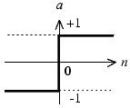
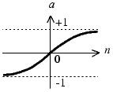

```{r setup_ch2, include=FALSE}
library("gym.plantuml")
if('alreadset' %in% ls()){
  knitr::opts_chunk$set(echo = FALSE)
  knitr::opts_chunk$set(warning = FALSE)
  knitr::opts_chunk$set(message = FALSE)
  alreadset <<- TRUE
}
```


## 人工神经元模型

### 人工神经元的模型：


该神经元拥有3个输入p1、p2和p3。其中，w和b是根据网络情况不断进行调整的，而传入函数s和传输函数f是事先选定，那究竟有哪些函数可以选择呢？传入函数比较简单，最常用的只有按照权重求和，在本例中，s处的输出（净输入n）就是：
```{r out.width=273}
plantuml("
@startmath
p_1*w_1+p_2*w_2+p_3*w_3+b*1
@endmath
         ")

```

### 常用传输函数

将该输出会作为参数传入输出函数*f*，并作为该神经元的最终输出。

函数名称  | 映射关系 | 图像 | 缩写 | 说明
--------- | -------- |----- | ----- |
阶梯函数  | a=0, n<=0<br />a=1, n>0 | | Step | n大于等于0时，输出1，否则输出0
符号函数  | a=-1, n<=0<br />a=1, n>0 |  | Sgn | n大于等于0时，输出1，否则输出-1
线性函数  | a=n |   | Linear | n本身就是神经元的输出


### 常用传输函数(续表)
函数名称  | 映射关系 | 图像 | 缩写 | 说明
--------- | -------- |----- | ----- |
饱和线性函数  | a=0, n<0<br />a=n, 0<=n<=1<br />a=1, n>1 |   | Ramp | n小于0时，输出0，n在0到1区间时，输出n，n大于1时，输出1
对数S形函数  | *a=1/(1+exp(-n))* |   | Sigmoid | 有界函数，无论n如何，输出永远在(0,1)的开区间。
双曲正切S形函数  |   |   | Tanh | 有界函数，无论n如何，输出永远在(-1,1)的开区间。

### 一个例子
假设p1=1，p2=0，p3=2，w1=1，w2=-1，w3=1，b=-1，则神经元的净输入为：
p1*w1+p2*w2+p3*w3+b*1 <br/>
  =1*1+0*-1+2*1-1  <br/>
  =2 * <br/>
  
此时，传输函数与神经元输出的关系如表所示


Step |	Sgn	| Linear| 	Ramp	| Sigmoid | 	Tanh
---- | ---- | ----- | ------- | ------- | ---- 
1    |	1	  | 2	    | 1	      | 0.881	  | 0.964


  

	

    


    

