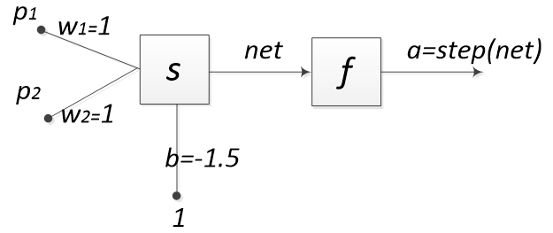

## 使用Java实现感知机及其应用

### 一个可以记忆逻辑与的神经网络



### 核心代码

```{.java}
01 private void createNetwork(int inputNeuronsCount) {
02 	// 设置网络类别为 感知机
03 	this.setNetworkType(NeuralNetworkType.PERCEPTRON);
04 
05 	// 建立输入神经元 ，表示输入的刺激
06 	NeuronProperties inputNeuronProperties = new NeuronProperties();
07 	inputNeuronProperties.setProperty("neuronType", InputNeuron.class);
08 
09 	// 由输入神经元构成的输入层
10 	Layer inputLayer = LayerFactory.createLayer(inputNeuronsCount, inputNeuronProperties);
11 	this.addLayer(inputLayer);
12 	// 在输入层增加BiasNeuron，表示神经元偏置
13 	inputLayer.addNeuron(new BiasNeuron());
14 
15 	//设置传输函数为step()函数
16 	NeuronProperties outputNeuronProperties = new NeuronProperties();
17 	outputNeuronProperties.setProperty("transferFunction", TransferFunctionType.STEP);
18 	Layer outputLayer = LayerFactory.createLayer(1, outputNeuronProperties);
19 	this.addLayer(outputLayer);
20 	
21 	//将输入层和输出层进行全连接
22 	ConnectionFactory.fullConnect(inputLayer, outputLayer);
23 	NeuralNetworkFactory.setDefaultIO(this);
24 	Neuron n = outputLayer.getNeuronAt(0);
25 	
26 	//设置输入神经元和感知机之间的连接权重
27 	n.getInputConnections()[0].getWeight().setValue(1);
28 	n.getInputConnections()[1].getWeight().setValue(1);
29 	n.getInputConnections()[2].getWeight().setValue(-1.5);
30 }
```


    

