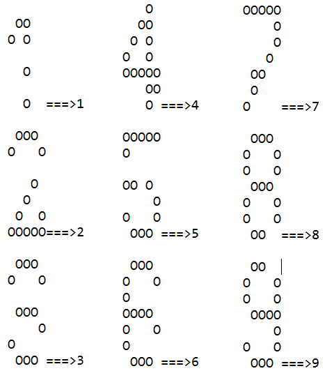

```{r setup_ch5, include=FALSE}
#if('alreadset' %in% ls()){
  knitr::opts_chunk$set(echo = FALSE)
  knitr::opts_chunk$set(warning = FALSE)
  knitr::opts_chunk$set(message = FALSE)
  library("gym.plantuml")
  alreadset <<- TRUE
#}
```

## ADALINE网络及其应用

### ADALINE网络结构


### ADALINE网络算法

```{r out.width=273}
data="
@startmath
w_(n\\ew) = w_(old) + 2alphaep
@endmath
"
plantuml(data)

```

```{r out.width=273}
data="
@startmath
b_(n\\ew) = b_(old) + 2alphae
@endmath
"
plantuml(data)
```

### ADALINE学习算法的实现

```{.java}
01 protected void updateNetworkWeights(double[] outputError) {
02     int i = 0;
03     // for each neuron in output layer
04     for (Neuron neuron : neuralNetwork.getOutputNeurons()) {
05         neuron.setError(outputError[i]); 
06         this.updateNeuronWeights(neuron); 
07         i++;
08     }
09 }
10 
11 protected void updateNeuronWeights(Neuron neuron) {
12     // 取得神经元误差
13     double neuronError = neuron.getError();
14 
15     // 根据所有的神经元输入 迭代学习
16     for (Connection connection : neuron.getInputConnections()) {
17         // 神经元的一个输入
18         double input = connection.getInput();
19         // 计算权值的变更
20         double weightChange = this.learningRate * neuronError * input;
21         // 更新权值
22         Weight weight = connection.getWeight();
23         weight.weightChange = weightChange;                
24         weight.value += weightChange;
25     }
26 }
```


### 使用ADALINE网络识别数字

使用ADALINE网络可以识别数字


### ADALINE网络对噪音的处理



    

