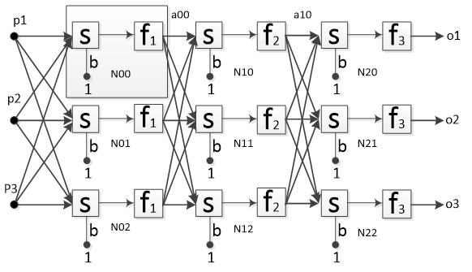
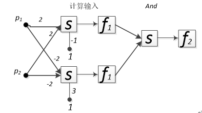
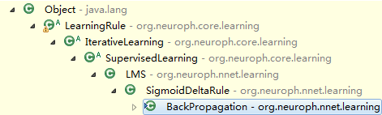

## 多层感知机和BP学习算法

### 多层感知机的结构




### 多层感知机处理异或问题



### 多层感知机学习算法的实现

在Neuroph框架中，对多层感知机算法的封装如下：



### BackPropagation算法简述

BackPropagation算法属于有监督的迭代训练，因此，从继承结构上看，它隶属于IterativeLearning和SupervisedLearning算法。这里的迭代指网络根据给定的训练数据在有限的循环周期内不断调整权值，直到误差到可接收范围，或者达到最大的迭代次数。有监督的学习方式表示BackPropagation需要使用期望值来调衡自身权值，也就是每次网络的输出都可以找到对应的误差，存在一个可靠的指标指导网络的训练

### 算法核心

BP神经网络要达到的目标是误差平方和最小，误差平方和公式：

```{r out.width=273}
data="
@startmath
e=1/2m ∑_(k=1)^m∑_(i=1)^(i=q)(t_i-ao_i)^2 
@endmath
"
plantuml(data)
```


