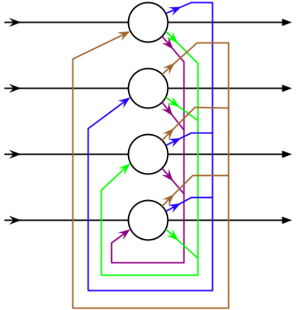
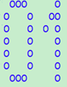
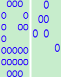

## Hopfield神经网络

### Hopfield神经网络结构

### Hopfield神经网络运行

可以看到，严格意义上说，网络只有一层，但是在这一层中，所有的神经元均两两连接。网络从一个输入向量开始计算后，每次迭代时，总是把上一次的输出作为下一次的输入。离散型Hopfield网络的神经元传输函数通常为符号函数sgn。单个神经元不接受自反馈，即wii=0，同时，网络的连接权重通常是对称的，wij=wji，即神经元i到神经元j的连接权值和神经元j到神经元i的连接权值是相等。权值矩阵的对成性，是网络能够收敛到吸引子的一个非常重要的前提条件。

### Hopfield网络还原带有噪点的字符

当Hopfield网络记住如下01后，就可以对带有噪音的数字进行联系识别

带有噪点的图片

