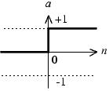
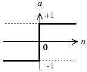
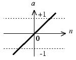
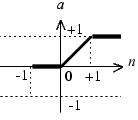
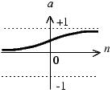
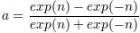
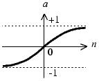

```{r setup, include=FALSE}
knitr::opts_chunk$set(echo = FALSE)
knitr::opts_chunk$set(warning = FALSE)
knitr::opts_chunk$set(message = FALSE)
library("gym.plantuml")
```

## 开启神经网络之旅

欢迎各位有志之士来到这里，闲话少说，让我们一起开启神经网络之旅吧！


### [全书代码下载](http://www.uucode.net/201702/nncode)

### 购买此书

## 人工神经元模型

人工神经元的模型：


该神经元拥有3个输入p1、p2和p3。其中，w和b是根据网络情况不断进行调整的，而传入函数s和传输函数f是事先选定，那究竟有哪些函数可以选择呢？传入函数比较简单，最常用的只有按照权重求和，在本例中，s处的输出（净输入n）就是：
```{r out.width=273}
plantuml("
@startmath
p_1*w_1+p_2*w_2+p_3*w_3+b*1
@endmath
         ")

```
	将该输出会作为参数传入输出函数*f*，并作为该神经元的最终输出。
	常用的传输函数有：

函数名称  | 映射关系 | 图像 | 缩写 | 说明
--------- | -------- |----- | ----- |
阶梯函数  | a=0, n<=0<br />a=1, n>0 | | Step | n大于等于0时，输出1，否则输出0
符号函数  | a=-1, n<=0<br />a=1, n>0 |  | Sgn | n大于等于0时，输出1，否则输出-1
线性函数  | a=n |   | Linear | n本身就是神经元的输出
饱和线性函数  | a=0, n<0<br />a=n, 0<=n<=1<br />a=1, n>1 |   | Ramp | n小于0时，输出0，n在0到1区间时，输出n，n大于1时，输出1
对数S形函数  | *a=1/(1+exp(-n))* |   | Sigmoid | 有界函数，无论n如何，输出永远在(0,1)的开区间。
双曲正切S形函数  |   |   | Tanh | 有界函数，无论n如何，输出永远在(-1,1)的开区间。


假设p1=1，p2=0，p3=2，w1=1，w2=-1，w3=1，b=-1，则神经元的净输入为：
p1*w1+p2*w2+p3*w3+b*1 <br/>
  =1*1+0*-1+2*1-1  <br/>
  =2 * <br/>
  
此时，传输函数与神经元输出的关系如表所示


Step |	Sgn	| Linear| 	Ramp	| Sigmoid | 	Tanh
---- | ---- | ----- | ------- | ------- | ---- 
1    |	1	  | 2	    | 1	      | 0.881	  | 0.964

传输函数在神经元模型中非常重要，通常会选择特定的传输函数来解决特定的问题。这里再强调3类函数。首先值得注意的是Step函数，它非常简单，当输入小于0时，函数输出0，大于0时，输出1。该函数可以把输入简单得分为2类。在后续讲到的感知机中，就使用了该函数。

其次，另外一个值得注意的函数是Linear线性函数，它总是简单的返回输入值。在一个Adaline网络中，会使用该函数。Adaline类似于感知机，但是因为使用线性函数和其对应的改良学习算法，Adaline相比感知机，可以更好的处理网络噪声。
最后一个值得注意的函数是Sigmoid函数，它接收任意实数输入，并将结果对应到0和1之间。该函数是可导的。因此，在BP神经网络中使用该函数（BP神经网络学习过程中，需要对传输函数求导）。

单个神经元就可以构成一个最简单的神经网络——感知机。感知机可以处理简单的分类问题。比如，现在有2类水果，苹果和香蕉，人们通过识别苹果和香蕉的形状和颜色差别，来区分苹果和香蕉两种水果。刚出生的婴儿无法区分苹果和香蕉，因为在他们的大脑里，没有对应的分类信息。但通过不断地训练和外部刺激，告诉他们红色的圆形的是苹果，黄色的弯形的是香蕉，不需要多久，婴儿就可以分区这两类水果。用类似的方法也可以让感知机正确得对苹果和香蕉分类。具体的分类过程和原理，将在下一章节介绍。


  

	

    


    

