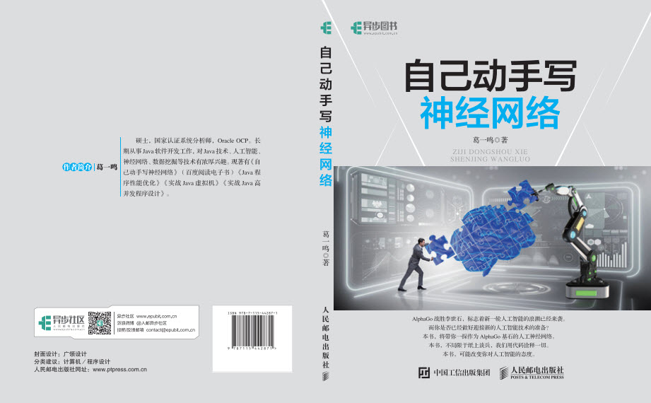

```{r setup, include=FALSE}
knitr::opts_chunk$set(echo = FALSE)
knitr::opts_chunk$set(warning = FALSE)
knitr::opts_chunk$set(message = FALSE)
library("gym.plantuml")
alreadset <<- TRUE
```

### 开启神经网络之旅

本PPT仅为《自己动手写神经网络》的提纲摘要


### 如何阅读我？

* 大家看到`右下角`箭头了吗？向左的箭头表示下一章节，向下的箭头表示下一页
* 看到`左下角`的菜单了吗，可以随意穿梭于整个文档
* 那么开始愉快的阅读吧！

### [全书代码下载](http://www.uucode.net/201702/nncode)

### 购买此书

[购买地址](http://www.uucode.net/201702/nncode)

```{r child = 'ch2.rmd'}
# 人工神经元模型
```

```{r child = 'ch3.rmd'}
# 神经网络框架Neuroph介绍
```

```{r child = 'ch4.rmd'}
# 使用Java实现感知机
```

```{r child = 'ch4.rmd'}
# 使用Java实现感知机
```

```{r child = 'ch5.rmd'}
# ADALINE网络及其应用
```

```{r child = 'ch6.rmd'}
# 多层感知机
```
	

```{r child = 'ch8.rmd'}
# Hopfield神经网络
```


```{r child = 'ch9.rmd'}
# BAM双向联想记忆网络
```
